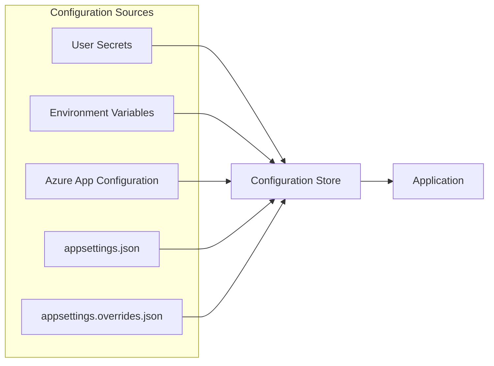

# Terrible Settings Auditor
Terrible Settings Auditor is an independent developer tool and is not affiliated with or endorsed by the Transportation Security Administration.   

"We screen your app settings before they crash on takeoff."

An open-source modern .NET tool that audits, validates your application's configuration and environment.

## How does it work?
Let's start with how modern .NET handles configuration to understand where this tool steps in.

### Modern .NET's Configuration Store
Modern .NET is based around a `Configuration Store` that can source multiple locations. For example, applications can include settings from User Secrets, Environment Variables, Azure App Configuration, appSettings.json, and more. The last store referenced will always win when looking up configuration keys.



The problem with validating configuration in a single source is that it doesn't check what the application is using at runtime.

### .NET DataAnnotations Validation
This is great, and we want this tool to pair well with this process. However, the downside is that it doesn't return a "report" and typically runs at startup.

#### Disadvantages
- Runs on Startup (past deployment gates)
- Doesn't run on demand.
- Isn't CI/CD pipeline friendly.

## How Terrible Settings Auditor Works


## 📦 NuGet Packages
TSA.Abstractions: Low-level package for attributes and configuration. (.NET Standard 2.0 for max compatibility)

### TerribleSettingsAuditor.Core
Shared logic for adding command-line interface used in validating configuration often used in CI/CD pipelines.    

### TerribleSettingsAuditor.Abstractions
This is the library with attributes that add metadata and help facilitate TSA.

## Vocabulary   
We used creative names to distinguish our attributes.

* Baggage – Configuration class the app can carry along.

* BaggageItem - Individual configuration property.

## Sample Configuration
TSA tracks your configuration by using attributes. `[Luggage]` applies to the classs and `[LuggageItem]` applies to the properties.

```csharp
[Luggage("Databases", "Application settings")]
public class ApplicationOptions
{
    /// <summary>
    ///  Configuration Key. (i.e., Application:DebugMode)
    /// </summary>
    public const string Position = "Application";

    public bool DebugMode { get; set; } = false;

    [LuggageItem("Application Title")]
    public string? Title { get; set; }

    [LuggageItem("DoesntNeedToBeSet")]
    public bool? DoesntNeedToBeSet { get; set; }
}
```

