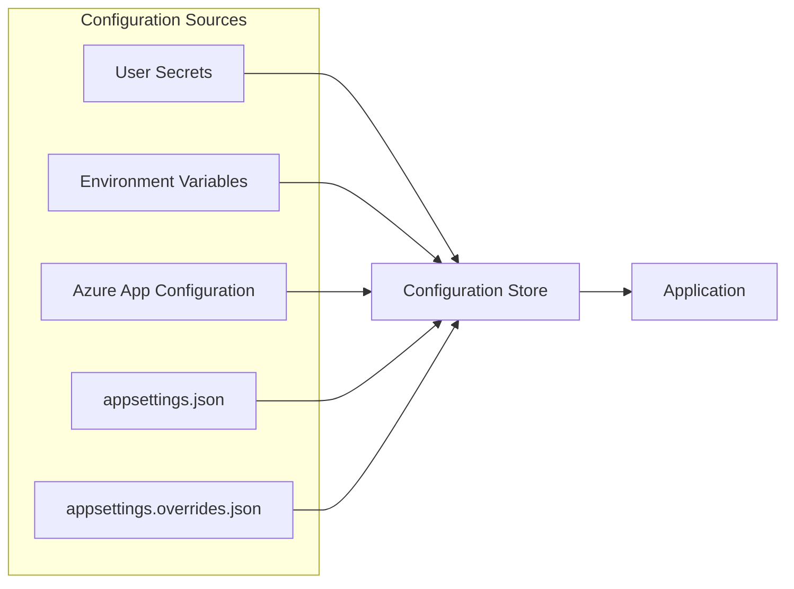
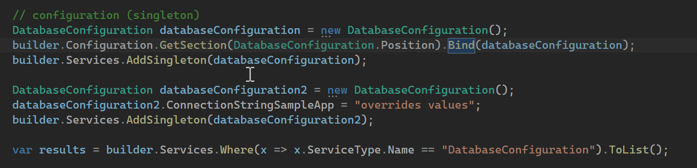
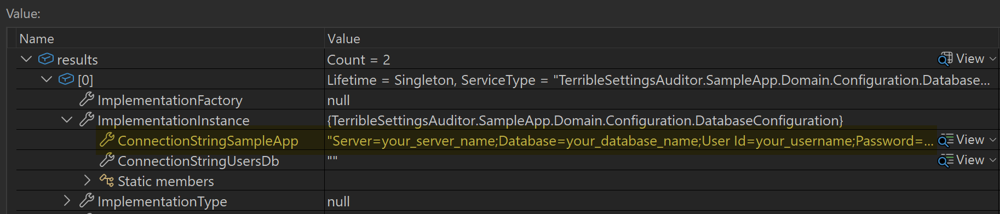
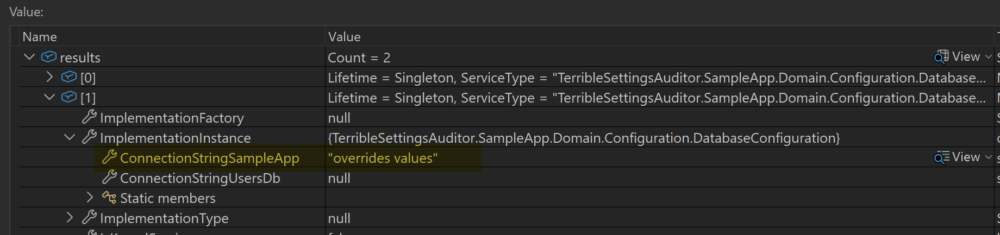
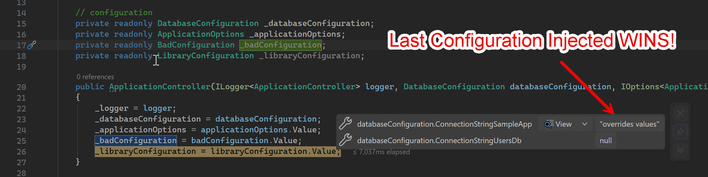
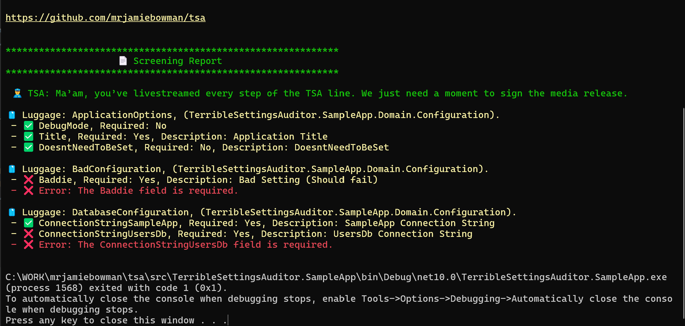

# Terrible Settings Auditor (TSA)
Terrible Settings Auditor is an independent developer tool and is not affiliated with or endorsed by the Transportation Security Administration.   

An open-source modern .NET tool that audits, validates your application's configuration and environment.

"We screen your app settings before they crash on takeoff."

## 🛠️ How does it work?
Let's start with how modern .NET handles configuration to understand where this tool steps in.

### Modern .NET's Configuration Store
Modern .NET is based around a `Configuration Store` that can source multiple locations. For example, applications can include settings from User Secrets, Environment Variables, Azure App Configuration, appSettings.json, and more. The last store referenced will always win when looking up configuration keys. 

**Verifying the individual sources alone doesn't always proove that the configuration is correct when the application runs.**



#### Sample Configuration Bootstrapping
```csharp
builder.Configuration
    .AddJsonFile("appsettings.json", optional: false, reloadOnChange: true)
    .AddUserSecrets<Program>(optional: true)
    .AddEnvironmentVariables()
    .AddJsonFile("appsettings.overrides.json", optional: false, reloadOnChange: true);
```

The problem with validating configuration in a single source is that it doesn't check what the application is using at runtime. When .NET injects the configuration it's using the store that loaded last with that value.

### Configuration Race Condition Explained
In this example, I'm creating and injecting 2 configuration classes to show how .NET handles this.

 

The first configuration class.   

 

The second configuration class.   

 

In the end... the Configuration class that is injected last wins!

 

This ultimately means that validating configuration at the source doesn't necessarily mean that the application will start succesfully.   

We believe that having a tool that can run at multiple steps of the development process will help navigate these issues. For example, local development, CI/CD pipelines, deployments, and on-demand as configuration can change.   

### .NET DataAnnotations Validation
This is great, and we want this tool to pair well with this process. However, the downside is that it doesn't return a "report" and only runs at startup.

#### Disadvantages
- Runs on Startup (past deployment gates)
- In a failed state, blocks startup with errors.
- Doesn't run on demand.
- Isn't CI/CD pipeline friendly.

### Our Solution
We see the missing piece here as being able to run configuration validation ("screening") on demand against any environment, generate reports, and output that to a command prompt or CI/CD pipeline. We also believe in making quality software that doesn't couple and force or trap developers into using our product. If you decide not to use this, uninstall "core" and remove the bootstrapping code and add in validations. This process wraps Data Annotations and turns it into a report.

#### Additional Features
Work in progress... but we want to extend this to generate schemas and do even more!


## 📦 NuGet Packages
TSA.Abstractions: Low-level package for attributes and configuration. (.NET Standard 2.0 for max compatibility)

### TerribleSettingsAuditor.Core
Shared logic for adding command-line interface used in validating configuration often used in CI/CD pipelines.    

### TerribleSettingsAuditor.Abstractions
This is the library with attributes that add metadata and help facilitate TSA.

## 📓 Vocabulary   
We used creative names to distinguish our attributes.

* Baggage – Configuration class the app can carry along.

* BaggageItem - Individual configuration property. Can be used to identify secrets.

## Sample
It's very simple to set up. 

For the in-house configuration classes add the `[Luggage]` attribute to the class. This helps TSA find your configuration classes. 

### Configuration
TSA tracks your configuration by using attributes. `[Luggage]` applies to the classs and `[LuggageItem]` applies to the properties.

```csharp
[Luggage("Databases", "Database Connection strings")]
public class DatabaseConfiguration
{
    /// <summary>
    ///  Configuration Key. (i.e., Database:ConnectionStringSampleApp)
    /// </summary>
    public const string Position = "Database";
    
    [Required]
    [LuggageItem("SampleApp Connection String", true)]
    public string? ConnectionStringSampleApp { get; set; }

    [Required]
    [LuggageItem("UsersDb Connection String", true)]
    public string? ConnectionStringUsersDb { get; set; }
}
```

### BootStrapping (Program.cs)
We'll need to include this.

```csharp
// tsa
builder.AddTerribleSettingsAuditor(s => {
    s.ScreenOnStartup = true;
    s.AbortScreenFailure = true;
});

var app = builder.Build();

// tsa
await app.UseTerribleSettingsAuditorAsync(args)
```

#### AddTerribleSettingsAuditor()
Configures how Terrible Settings Auditor should operate by default.   

#### app.UseTerribleSettingsAuditorAsync(args)
This line takes command line arguments and processes them to handle running tsa commands against the app.   

### CLI Commands
We can now run CLI commands through the `LaunchSettings.json` file or through terminal.

* `dotnet run MyApp.dll tsa --screen`
* `MyApp.exe tsa --screen`

### Screening Report
This is meant to be a paradoy and to make this process fun.   

 

